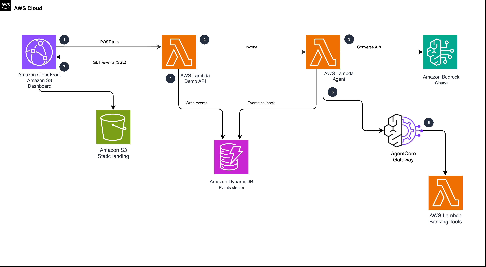

# AgentCore Gateway + Dogwood temporal policies

This sample teaches how to govern AI agent behavior with Dogwood temporal policies in Amazon Bedrock AgentCore Gateway. Through a deployable, visual lab, you run six attack and failure scenarios against an agent and watch session-aware policies stop each one at the Gateway.

[Dogwood](https://github.com/dogwood-policy) is an AWS's open source governance language for AI agents and their tools. It builds on [Cedar](https://github.com/cedar-policy) and adds temporal conditions that look back over an agent's event history, so a policy can require prerequisites ("approval before execution"), enforce running limits ("no more than $5,000 per session"), or react to what the session has already seen ("no transfers after reading untrusted content"). Policy in Amazon Bedrock AgentCore evaluates these policies on every tool call at the AgentCore Gateway, outside the agent's code, where the agent cannot see or bypass them.

In the lab, an Amazon Bedrock AgentCore agent operates synthetic banking tools behind AgentCore Gateway, and a dashboard renders every verdict live. The scenarios cover a hallucinated transfer destination, salami-slicing past a budget, a retry storm, approval replay (including concurrent double-execution), prompt injection via tool content, and an enforce-versus-observe toggle. Together they exercise Dogwood's core operators: formerly, since, anchored count, sum, and bind.

Everything is provisioned with the AWS CDK, deploys with one command, uses only synthetic data, and includes an end-to-end smoke test that verifies the expected verdicts.

## The six escenarios

| Act | What happens | What stops it |
| --- | --- | --- |
| 1. Legitimate work | Agent looks up a customer's account, then transfers to that account | Nothing. The temporal permit matches the prior lookup response |
| 2. The hallucinated account | In one session: a valid transfer to a looked-up account (ALLOW), then a transfer to an account no lookup ever returned (DENY) | `TransferRequiresLookup`: output-to-input integrity (`formerly within 1h ... output.accountId: context.input.toAccount`) |
| 3. Salami slicing | Eight $900 purchases, each under any per-call threshold | `SessionBudgetCap`: a `sum` aggregation forbids the purchase that pushes the session past $5,000 |
| 4. The retry storm | Scripted concurrent burst (labeled as simulated) against a failing tool | A gateway rate limit of 1 request/second on that tool throttles a large share of the flood |
| 5. The consumed approval | Maker-checker: the agent gets one trade approval, executes, then tries to reuse the approval | `TradeRequiresUnusedApproval` (negated-left `since`): each approval authorizes one trade for the exact ticker and quantity. `TradeOneAttemptPerApproval` (anchored `count` + `bind`) counts in-flight attempts, so concurrent executions cannot share one approval |
| 6. The poisoned research | The agent reads a research note carrying a prompt injection, then runs the *same legitimate transfer Act 1 allowed* | `TaintedSessionNoTransfer` (`forbid` + `formerly`): untrusted content in the session forbids all transfers, and a forbid overrides every permit |
| Finale. The toggle | Flip the policy engine to `LOG_ONLY` and re-run Act 2 | Nothing, and that is the lesson. The engine evaluates and traces but does not enforce. Flip back to `ENFORCE` and the rules apply again |

Act 4 uses scripted burst traffic rather than an LLM loop. The dashboard labels it as simulated; the rate limit enforcement itself is real.

## Architecture



Everything is provisioned with the AWS CDK. The gateway, targets, policy engine, and policies
(including the Dogwood temporal statements) are native CloudFormation resources. Gateway rate
limits have no CloudFormation resource type yet, so a CDK custom resource calls the
`CreateGatewayRateLimit`, `UpdateGatewayRateLimit`, and `DeleteGatewayRateLimit` control-plane
APIs.

## Prerequisites

- An AWS account with Amazon Bedrock AgentCore available and a Bedrock Claude model enabled
  (default: `us.anthropic.claude-sonnet-4-5-20250929-v1:0`, override with `--model-id`)
- A region where temporal policies are supported (default: `us-east-1`)
- Node.js 18+, Python 3.9+, and AWS CLI v2 with credentials

## Deploy

```bash
./deploy.sh --email you@example.com --profile <your-profile> --region us-east-1
```

The script does CDK bootstrap (if needed), all stacks, the dashboard build and publish,
and the first Amazon Cognito user. `--email` is required. That address receives an invitation
email with a temporary password, and Cognito asks for a permanent one on first sign-in.

The dashboard is protected by a Cognito user pool (email and password through the Cognito Hosted
UI, authorization code flow with PKCE). Every demo API route is protected by an Amazon API Gateway
JWT authorizer against that pool. Self sign-up is disabled. Add more users with
`aws cognito-idp admin-create-user`; the deploy script prints the exact command.

## Running the demo

Open the dashboard and run the acts in order:

1. **Act 1** establishes the normal flow: lookup, then transfer. Everything passes.
2. **Act 2** runs both transfers in a single session. The legitimate one passes, and the same
   tool with the same caller is denied for a destination no lookup ever returned. A stateless
   check cannot tell those two transfers apart. Read the denial reason from the decision log.
3. **Act 3** fills the budget gauge. Five purchases pass and the sixth bounces. No single
   purchase broke a rule; the running total did.
4. **Act 4** floods a failing tool. Throttled verdicts pile up while the other tools stay
   unaffected.
5. **Act 5** is one approval, one trade. The second execution is denied because the approval was
   consumed. A fresh approval opens the gate exactly once more.
6. **Act 6** has the agent read a poisoned research note (indirect prompt injection), then perform
   the exact lookup-and-transfer that Act 1 allowed. It is denied. Untrusted content entered the
   session, so a `forbid` blocks money movement for the rest of it, overriding every permit. The
   policy layer reasons about where the session has been, not just what the call looks like.
7. **The toggle** (top right): switch to `LOG_ONLY`, re-run Act 2, and the same hallucinated
   transfer passes with an amber trace. Switch back to `ENFORCE` and it is denied again.

Each act runs in a fresh policy session (a new `x-amzn-bedrock-agentcore-policy-session-id`), so
acts are independent and repeatable.

To verify a deployment end to end without the browser, run the smoke test (requires `boto3`). It
creates a short-lived Cognito test user, authenticates, exercises all six acts, asserts the
expected verdicts, and deletes the test user afterwards:

```bash
AWS_PROFILE=<your-profile> python3 scripts/smoke_test.py
```

## Clean up

```bash
./destroy.sh --profile <your-profile> --region us-east-1
```

## What is enforced where

- **Temporal policies** (Dogwood) are evaluated by Policy in AgentCore at the gateway on every
  `tools/call`, against the session trajectory. Decisions are deterministic and deny-by-default.
- **Rate limits** are evaluated by the gateway before policies. They fail open and are a
  traffic-management control, not a security boundary.
- The **agent code contains no policy logic**. It only reports what the gateway returned.

## Cost

The demo is serverless: AWS Lambda, Amazon DynamoDB (on-demand), Amazon API Gateway, Amazon
CloudFront, Amazon S3, AgentCore Gateway and Policy usage, and Bedrock model invocations per act
run. Running a handful of acts costs cents, and the largest component is Bedrock token usage.
Destroy the stacks when finished.

## Security notes

This is a demonstration, not a production reference:

- The dashboard requires Cognito sign-in (Hosted UI, PKCE), and the demo API requires a valid JWT
  from the same user pool. Self sign-up is disabled. The static assets themselves are served
  publicly by CloudFront; all data and actions live behind the authenticated API.
- All banking data is synthetic and hardcoded. No real accounts or funds exist.
- IAM is least-privilege: the agent's `bedrock:InvokeModel` is scoped to the configured model's
  ARNs, and `iam:PassRole` is constrained by `PassedToService`.
- The session-scoped budget and rate limits shown here shape agent behavior within a session. A
  caller who controls their own session IDs can start new sessions. See
  [Security considerations](https://docs.aws.amazon.com/bedrock-agentcore/latest/devguide/policy-temporal.html)
  in the AgentCore documentation.

## Learn more

- [Temporal policies in Amazon Bedrock AgentCore](https://docs.aws.amazon.com/bedrock-agentcore/latest/devguide/policy-temporal.html)
- [The Dogwood policy language](https://github.com/dogwood-policy/dogwood)
- [Rate limits on AgentCore Gateway](https://docs.aws.amazon.com/bedrock-agentcore/latest/devguide/gateway-rate-limits.html)

## Security

See [CONTRIBUTING](CONTRIBUTING.md#security-issue-notifications) for more information.

## Contributing

See [CONTRIBUTING](CONTRIBUTING.md) for more information.

## License

This library is licensed under the MIT-0 License. See the [LICENSE](LICENSE) file.
